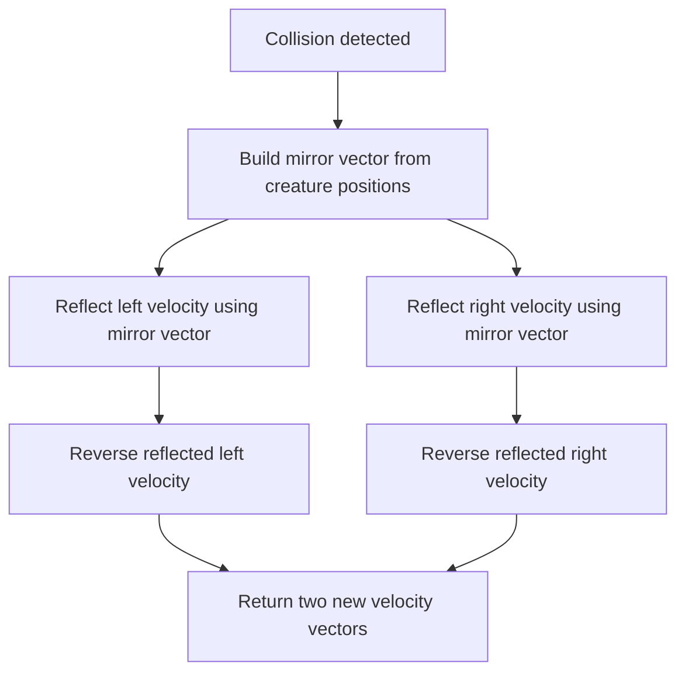
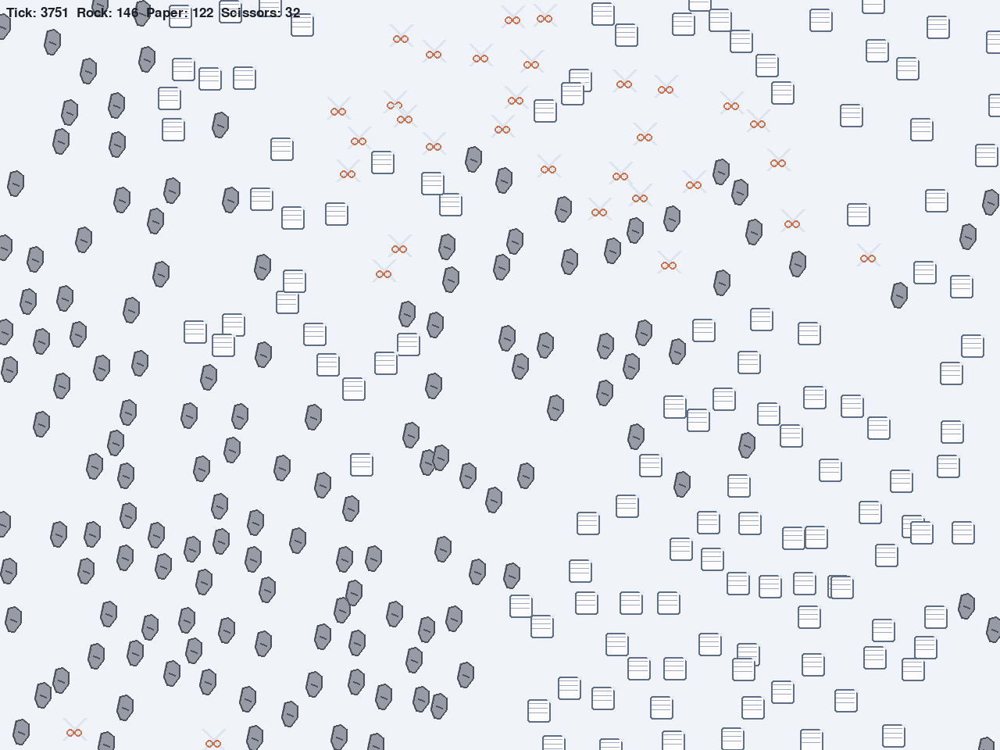

# Session Log - 2026-02-16

## Session Info
- Participants: Jonah
- Focus: Record baseline state of the project with screenshots

## Note
The 3 most recent screenshots are the beginning, middle, and end of our starting point of the program as it is now.

## Observation Note
At the start there is a mix, but in the middle scissors had the most. In the end rock won because the scissors killed all of the papers, so the rock could not be killed.

Simulations go on a lot longer when the creatures bounce off each other due to the fact that they do not mix as well.

## Jonah Bounce Function And Diagram
Jonah wrote the bounce mechanic function using mirror reflection and reversal.

```python
def mirror_vector(
    mx: float,
    my: float,
    x: float,
    y: float,
) -> tuple[float, float]:
    mirror_len_sq = (mx * mx) + (my * my)
    if mirror_len_sq == 0.0:
        return x, y

    scale = ((x * mx) + (y * my)) / mirror_len_sq
    parallel_x = scale * mx
    parallel_y = scale * my
    return (2.0 * parallel_x) - x, (2.0 * parallel_y) - y


def bounce_velocity_stencil(
    left_creature: Creature,
    right_creature: Creature,
) -> tuple[tuple[float, float], tuple[float, float]]:
    mx = left_creature.pos.x - right_creature.pos.x
    my = left_creature.pos.y - right_creature.pos.y
    new_vleft = mirror_vector(mx, my, left_creature.vx, left_creature.vy)
    new_vright = mirror_vector(mx, my, right_creature.vx, right_creature.vy)
    new_vleft = -new_vleft[0], -new_vleft[1]
    new_vright = -new_vright[0], -new_vright[1]
    return (new_vleft, new_vright)
```



## Evidence
### Beginning


### Middle


### End


### Newest Bounce Screenshot


## Source Screenshot Files
- `screenshots/rpsbattle-20260216-133120-881097.png`
- `screenshots/rpsbattle-20260216-133133-893626.png`
- `screenshots/rpsbattle-20260216-133140-237537.png`
- `screenshots/rpsbattle-20260216-143836-435335.png`
